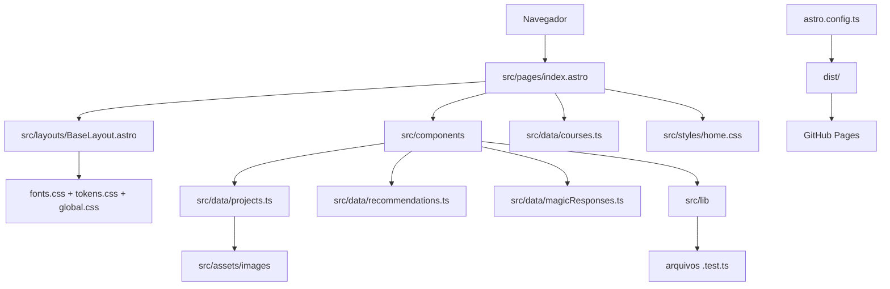

# Jean Sousa Liz — Portfólio

Código-fonte do portfólio profissional de Jean Sousa Liz, preparado para publicação em <https://jsousaliz.github.io>.

O projeto é uma página única gerada estaticamente. Astro monta a estrutura e entrega HTML pronto; React é usado somente na experiência interativa Mystic Coffee.

## Stack

- Astro para geração estática, rotas, layout e composição da página.
- React para a única interação que precisa de estado complexo.
- TypeScript em modo estrito.
- CSS autoral, organizado em fundação global e estilos da página.
- Vitest para testar regras independentes da interface.
- Sharp para gerar PNGs a partir dos SVGs da identidade visual.
- GitHub Actions e GitHub Pages para validação e publicação.

## Como o projeto se conecta



O ponto de entrada é [`src/pages/index.astro`](src/pages/index.astro). Ele define a ordem das seções e reúne os componentes. A explicação completa desse fluxo está no [guia de arquitetura e leitura do código](docs/GUIA-DE-ARQUITETURA.md).

## Mapa das pastas

```text
.
├── .github/workflows/       validação e publicação no GitHub
├── docs/                    documentação para entender o código
├── plan/                    planejamento privado, ignorado pelo Git
├── public/                  arquivos servidos sem transformação
├── scripts/                 automações executadas pelo Node.js
├── src/
│   ├── assets/images/       imagens importadas e otimizadas pelo Astro
│   ├── components/          blocos visuais e interativos
│   ├── data/                conteúdo estruturado em TypeScript
│   ├── layouts/             documento HTML, SEO e estrutura compartilhada
│   ├── lib/                 regras puras, independentes da interface
│   ├── pages/               rotas; index.astro gera a página inicial
│   └── styles/              fontes, variáveis, base global e página inicial
├── astro.config.ts          configuração do Astro e do React
├── package.json             dependências e comandos do projeto
├── tsconfig.json            regras do TypeScript e atalho @/
└── vitest.config.ts         configuração dos testes unitários
```

Pastas geradas, como `node_modules/`, `.astro/` e `dist/`, não são código-fonte e estão ignoradas pelo Git.

## Onde alterar cada coisa

| Objetivo                                   | Arquivo principal                       |
| ------------------------------------------ | --------------------------------------- |
| Mudar a ordem ou o texto das seções gerais | `src/pages/index.astro`                 |
| Alterar projetos                           | `src/data/projects.ts`                  |
| Alterar recomendações                      | `src/data/recommendations.ts`           |
| Alterar cursos                             | `src/data/courses.ts`                   |
| Alterar frases da Mystic Coffee            | `src/data/magicResponses.ts`            |
| Alterar o funcionamento da Mystic Coffee   | `src/components/MagicBall.tsx`          |
| Alterar cores, fontes e medidas globais    | `src/styles/tokens.css`                 |
| Alterar o layout da página inicial         | `src/styles/home.css`                   |
| Alterar SEO, favicon ou metadados sociais  | `src/layouts/BaseLayout.astro`          |
| Alterar navegação principal                | `src/components/SiteHeader.astro`       |
| Alterar setas flutuantes entre seções      | `src/components/SectionNavigator.astro` |

## Requisitos

- Node.js 24 LTS.
- npm 11 ou versão compatível fornecida com o Node.js.

## Comandos

```text
npm install              instala as dependências
npm run dev              inicia o ambiente local
npm run check            verifica Astro e TypeScript
npm test                 executa os testes unitários
npm run build            valida e gera o site estático em dist/
npm run preview          abre localmente o resultado do build
npm run assets:generate  recria favicon.png e og-card.png com Sharp
npm run format           formata os arquivos do projeto
npm run validate         verifica formatação, testes, tipos e build
```

Para iniciar localmente no PowerShell:

```powershell
cd C:\Projetos\Jean\Jsousaliz
npm run dev
```

## Qualidade e publicação

O workflow `quality.yml` executa `npm run validate` em pushes e pull requests. O workflow `deploy.yml` gera o site e publica o conteúdo estático no GitHub Pages quando acionado manualmente.

O planejamento editorial permanece em `plan/` e não é versionado. A documentação técnica de aprendizagem fica em `docs/` e faz parte do repositório.

## Licença

Este é um projeto de código-fonte público para demonstração profissional, mas não é open source. O uso, a cópia, a modificação, a distribuição e a publicação por terceiros não são autorizados. Consulte a [licença proprietária](LICENSE).
