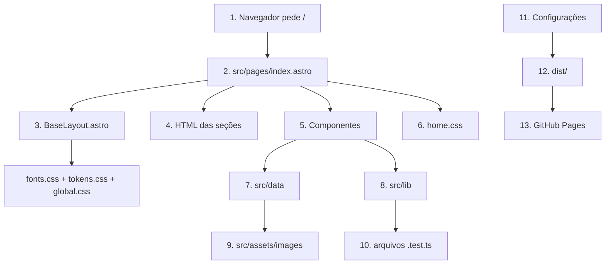
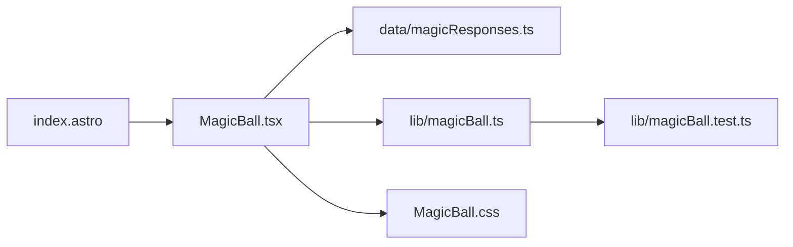

# Guia de arquitetura e leitura do código

Este guia explica o portfólio a partir do ponto de entrada e acompanha as conexões reais entre os arquivos. A ideia não é decorar a estrutura, mas entender o caminho percorrido até algo aparecer e funcionar no navegador.

## 1. O desenho geral



O fluxo pode ser resumido assim:

1. `index.astro` decide **o que existe e em qual ordem**.
2. Os componentes encapsulam **partes com responsabilidade própria**.
3. `data` guarda **conteúdo repetível e estruturado**.
4. `lib` guarda **regras que podem ser testadas sem navegador**.
5. Os estilos decidem **como tudo aparece**.
6. O Astro reúne tudo e gera HTML, CSS e JavaScript estáticos em `dist/`.

## 2. Começando por `src/pages/index.astro`

No Astro, cada arquivo dentro de `src/pages` cria uma rota. Como o arquivo se chama `index.astro`, ele gera a página `/`, que será a página inicial do GitHub Pages.

Um arquivo `.astro` normalmente tem duas partes.

### 2.1 Frontmatter

O trecho entre `---` no começo do arquivo executa durante a construção do site:

```astro
---
import { Image } from 'astro:assets';
import SiteHeader from '@/components/SiteHeader.astro';
import BaseLayout from '@/layouts/BaseLayout.astro';
import '@/styles/home.css';

const title = 'Jean Sousa Liz | Software Developer';
---
```

Ele importa componentes, imagens, dados e estilos, além de preparar valores usados no HTML. Esse código não é enviado inteiro ao navegador.

O prefixo `@/` significa `src/`. Essa abreviação foi configurada em `tsconfig.json`:

```ts
'@/*': ['src/*'];
```

Assim, `@/components/SiteHeader.astro` é o mesmo que `src/components/SiteHeader.astro`, mas continua legível mesmo se o arquivo que faz a importação mudar de pasta.

### 2.2 Template

Depois do segundo `---` vem a marcação da página:

```astro
<BaseLayout title={title} description={description}>
  <SiteHeader />
  <main id="conteudo">
    <!-- seções -->
  </main>
</BaseLayout>
```

As chaves inserem valores TypeScript no HTML. Tags iniciadas com letra maiúscula são componentes importados; tags minúsculas, como `main` e `section`, são HTML comum.

O `index.astro` também define a ordem visual atual:

1. Hero (`#inicio`).
2. Sobre (`#sobre`).
3. Trajetória (`#trajetoria`).
4. Especialidades (`#especialidades`).
5. Projetos (`#projetos`).
6. Mystic Coffee (`#magic-ball`).
7. Recomendações (`#recomendacoes`).
8. Aprendizado (`#aprendizado`).
9. Contato (`#contato`).

Os links do menu apontam para esses identificadores. Os atributos `data-navigation-section` permitem que os scripts descubram qual seção está visível sem acoplar essa lógica ao texto exibido.

### 2.3 Conteúdo direto e conteúdo separado

Nem todo texto precisa estar em um arquivo de dados. A apresentação pessoal e a trajetória existem diretamente no `index.astro` porque são blocos únicos, ligados ao desenho da página.

Cursos, projetos e recomendações são listas. Eles ficam em `src/data`, pois cada item segue a mesma estrutura e pode ser renderizado com `map` ou `filter`:

```ts
const completedCourses = courses.filter(
  (course) => course.status === 'completed',
);
```

Regra prática deste projeto:

- bloco único e editorial: pode ficar no `index.astro`;
- coleção de itens semelhantes: fica em `src/data`;
- interação ou bloco grande com responsabilidade própria: vira componente.

## 3. `BaseLayout.astro`: a moldura da página

O `index.astro` é colocado dentro de `src/layouts/BaseLayout.astro` por meio do `<slot />`.

Pense no layout como uma moldura reutilizável. Ele cuida de assuntos que pertencem ao documento inteiro:

- `<!doctype html>`, `<html>`, `<head>` e `<body>`;
- idioma da página;
- título e descrição;
- URL canônica;
- metadados Open Graph e Twitter;
- favicon e manifesto;
- dados estruturados `Person` para mecanismos de busca;
- tema inicial claro ou escuro;
- link de acessibilidade “Pular para o conteúdo”.

O fluxo é:

```text
index.astro envia title e description
        ↓
BaseLayout monta <head> e <body>
        ↓
<slot /> recebe todo o conteúdo do index.astro
```

O layout também importa os três estilos fundamentais:

- `fonts.css`: carrega as famílias tipográficas;
- `tokens.css`: define variáveis reutilizáveis de cor, espaço, borda e fonte;
- `global.css`: aplica reset, estilos básicos, container, botões e acessibilidade.

Já `home.css`, importado pelo `index.astro`, contém os layouts específicos desta página.

## 4. Componentes Astro usados pela página

Componentes `.astro` geram HTML no build e podem incluir um `<script>` pequeno para comportamento no navegador.

### `SiteHeader.astro`

Renderiza nome, menu, botão de tema e menu móvel. Ele importa `ThemeToggle.astro`. Seu script abre e fecha a navegação móvel; seus links usam os IDs definidos no `index.astro`.

### `SectionHeading.astro`

Padroniza o número, o rótulo, o título e o texto introdutório das seções. Evita repetir a mesma estrutura de título várias vezes.

### `ExperienceYears.astro`

Mostra os anos de experiência calculados desde janeiro de 2010. A regra de data está em `src/lib/experience.ts`, onde pode ser testada sem depender do componente.

### `ProjectShowcase.astro`

Importa `projects` de `src/data/projects.ts`, percorre a lista e cria os cards. O componente cuida da apresentação e da expansão; o arquivo de dados cuida do conteúdo.

```text
projects.ts
   ↓ lista tipada de projetos
ProjectShowcase.astro
   ↓ cards, botões, diagramas e detalhes
index.astro
   ↓ posiciona o conjunto na seção Projetos
```

O script interno responde ao botão “Conheça o projeto”, atualizando painel, texto, ícone e `aria-expanded`.

### `RecommendationCarousel.astro`

Importa as recomendações, cria os cards e oferece rolagem, arraste, teclado, botões e indicadores. As contas genéricas de índice estão em `src/lib/carousel.ts` e são cobertas por `carousel.test.ts`.

### `ScrollEnhancements.astro`

Observa elementos marcados com `data-reveal` para aplicar a entrada visual e acompanha as seções para indicar o link ativo do menu. Ele não cria conteúdo visível; adiciona comportamento progressivo ao HTML existente.

### `SectionNavigator.astro`

Descobre as seções marcadas com `data-navigation-section` e controla as setas flutuantes de anterior/próxima. Como está isolado, pode ser removido do `index.astro` sem afetar o restante da página.

## 5. Por que a Mystic Coffee usa React

`MagicBall.tsx` é o único componente React. Ele precisa guardar e coordenar vários estados durante a interação: ocioso, sacudindo, resposta exibida e resposta desaparecendo; além da frase, duração, gesto de arrastar, temporizadores e histórico recente.

No `index.astro`, ele aparece assim:

```astro
<MagicBall client:visible />
```

`client:visible` é uma diretiva do Astro. O HTML inicial é entregue normalmente, mas o JavaScript do React só é ativado quando a seção se aproxima da área visível. Isso evita carregar interatividade antes de ela ser necessária.



- `magicResponses.ts` contém somente as frases;
- `magicBall.ts` escolhe respostas e monta o ciclo de durações;
- `MagicBall.tsx` coordena estado, eventos e tempo;
- `MagicBall.css` desenha e anima a esfera;
- `magicBall.test.ts` garante que a aleatoriedade controlada respeite as regras.

Essa separação permite alterar uma frase sem tocar na lógica, ou testar a lógica sem renderizar React.

## 6. `src/data`: conteúdo com formato conhecido

Os arquivos de dados exportam interfaces e listas TypeScript.

### `projects.ts`

Define o contrato `Project` e os projetos exibidos. Também importa imagens de `src/assets/images`, permitindo que o Astro conheça largura, altura e formato durante o build.

### `recommendations.ts`

Separa trecho visível, texto completo, iniciais, nome e cargo. `recommendations.test.ts` verifica integridade editorial, como a exigência de que o trecho seja parte da recomendação original.

### `courses.ts`

Cada curso possui título, instituição, período e estado. O `index.astro` usa o estado para separar concluídos e em andamento.

### `magicResponses.ts`

Lista imutável de respostas da Mystic Coffee. `as const` informa ao TypeScript que os textos são valores literais e não uma lista genérica de strings mutáveis.

## 7. `src/lib`: regras sem interface

Uma função em `lib` não deveria conhecer HTML, CSS ou o navegador. Ela recebe valores, aplica uma regra e retorna um resultado.

Exemplos:

- `experience.ts`: calcula anos completos desde a data inicial;
- `carousel.ts`: limita índices e encontra o card mais próximo;
- `magicBall.ts`: escolhe uma frase sem repetição imediata e embaralha durações.

Esse estilo torna as regras pequenas e testáveis. Os arquivos com sufixo `.test.ts` são executados pelo Vitest com `npm test`.

## 8. Estilos: do geral para o específico

```text
fonts.css
   ↓ fontes disponíveis
tokens.css
   ↓ decisões do sistema visual
global.css
   ↓ comportamento comum da página
home.css / MagicBall.css / estilos dos componentes
   ↓ aparência específica
```

Antes de trocar uma cor ou medida repetida, procure uma variável em `tokens.css`. Antes de criar um estilo de botão novo, procure o padrão existente em `global.css`. Use `home.css` para grids e seções exclusivas da página inicial.

Alguns componentes Astro mantêm seus estilos no próprio arquivo. Por padrão, o Astro limita esses seletores ao componente, reduzindo colisões com outras partes da página.

## 9. Imagens, `public` e Sharp

Existem dois caminhos para imagens.

### `src/assets/images`

Imagens de conteúdo são importadas pelo código. O Astro pode ler seus metadados e otimizar a entrega por meio do componente `<Image />`.

### `public`

Arquivos em `public` são copiados diretamente para o site e mantêm o caminho original, como `/favicon.png`, `/robots.txt` e `/site.webmanifest`.

O script `scripts/generate-brand-assets.mjs` usa o Sharp para converter:

```text
favicon.svg → favicon.png (512 × 512)
og-card.svg → og-card.png (1200 × 630)
```

Ele roda com `npm run assets:generate`. O `sharp` está declarado diretamente em `devDependencies` porque é uma ferramenta usada no desenvolvimento, não código executado pelo visitante.

## 10. Configuração, build e publicação

### `astro.config.ts`

Define a URL pública, a saída estática, a integração React e caches separados do Vite para desenvolvimento, verificação, build e preview.

### `tsconfig.json`

Ativa a configuração mais estrita do TypeScript e cria o atalho `@/` para `src/`.

### `vitest.config.ts`

Executa testes `src/**/*.test.ts` no ambiente Node, adequado para regras que não dependem do DOM.

### `package.json`

É o catálogo do projeto: `dependencies` são necessárias para construir ou executar o site; `devDependencies` são ferramentas; e `scripts` são comandos padronizados.

### GitHub Actions

`.github/workflows/quality.yml` instala versões exatas com `npm ci` e executa `npm run validate`.

`.github/workflows/deploy.yml` constrói o site e envia o resultado ao GitHub Pages. O conteúdo publicado vem de `dist/`, que é gerado e não deve ser editado manualmente.

## 11. Acompanhe uma alteração de ponta a ponta

Exemplo: adicionar uma resposta à Mystic Coffee.

1. Edite `src/data/magicResponses.ts`.
2. `MagicBall.tsx` já importa essa lista.
3. `src/lib/magicBall.ts` recebe a lista e escolhe a resposta.
4. `MagicBall.tsx` guarda o resultado no estado e o renderiza.
5. `MagicBall.css` controla como o texto aparece e desaparece.
6. `npm test` verifica a regra de seleção.
7. `npm run build` confirma que Astro, React e TypeScript geram a página.

Exemplo: alterar um projeto.

1. Edite `src/data/projects.ts`.
2. `ProjectShowcase.astro` percorre automaticamente a lista atualizada.
3. O `index.astro` não muda, pois apenas posiciona `<ProjectShowcase />`.
4. Os estilos continuam aplicando o mesmo padrão visual.

## 12. Ordem segura para estudar

Não tente compreender todos os arquivos ao mesmo tempo:

1. Abra `src/pages/index.astro` e identifique imports, layout e seções.
2. Abra `BaseLayout.astro` e encontre o `<slot />`.
3. Escolha um componente simples, como `SectionHeading.astro`.
4. Siga Projetos: `index.astro` → `ProjectShowcase.astro` → `projects.ts` → imagens.
5. Siga Recomendações: componente → dados → `carousel.ts` → teste.
6. Por último, siga Mystic Coffee: React → dados → regra → CSS → teste.
7. Termine em `package.json`, configurações e workflows para entender validação e publicação.

Ao estudar, faça sempre quatro perguntas:

1. Quem importa este arquivo?
2. O que este arquivo exporta ou renderiza?
3. Ele contém conteúdo, apresentação ou regra?
4. Como eu provo que uma alteração nele continua funcionando?

Com essas perguntas, a quantidade de arquivos deixa de ser uma lista solta e passa a ser um conjunto de responsabilidades conectadas.
